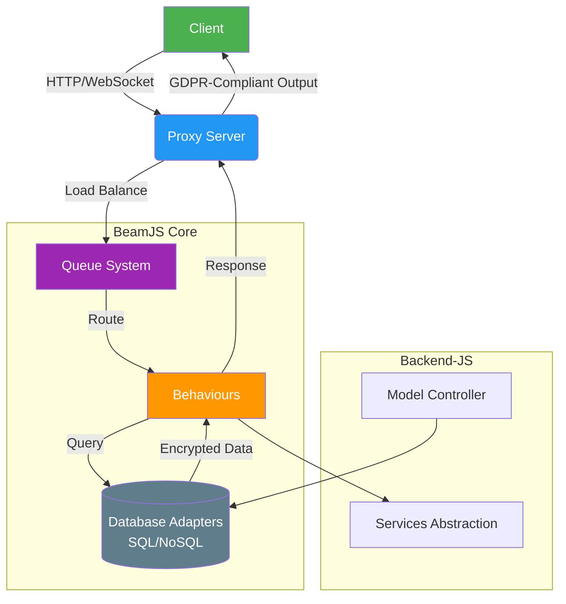

# BeamJS [](https://www.codacy.com/gh/QuaNode/beamjs/dashboard) [](https://www.npmjs.com/package/beamjs) [](https://beamjs.dev)


**Enterprise Framework for Private IoB & Adaptive Systems**  
*(Backend-JS | ExpressJS | Angular | SQL/NoSQL Databases)*

## 🚀 Why BeamJS?
BeamJS simplifies building enterprise-grade applications with:
- **GDPR Compliance**: Built-in encryption & pseudonymization.
- **Real-Time Architecture**: Hybrid HTTP/WebSocket workflows.
- **Scalability**: 10k+ sessions/minute on 1vCPU AWS instances.
- **Unified API**: Work seamlessly across SQL/NoSQL databases.

👉 **[Explore Full Documentation](https://beamjs.dev)**

## 📐 Architecture Overview



## ⚡ Quick Start

### 1. Install
```bash
npm install beamjs functional-chain-behaviour
```

### 2. Create Your First API
```javascript
// app.js
const backend = require("beamjs").backend();
const { FunctionalChainBehaviour } = require('functional-chain-behaviour')();

// Define a model
const User = backend.model({ name: "User" }, { 
  username: String, 
  password: String 
});

// Create a GDPR-ready API endpoint
backend.behaviour(
  { 
    name: "GetUsers", 
    path: "/users", 
    method: "GET", 
    inherits: FunctionalChainBehaviour 
  },
  function (init) {
    return function () {
      const self = init.apply(this, arguments).self();
      self.entity(new User()).query().pipe(); // Query data
    };
  }
);

// Start server
backend.app(__dirname + '/behaviours', { port: 3000 }).listen();
```

### 3. Run
```bash
node app.js
```
**Visit `http://localhost:3000/users` → Your API is live!**

## 🔑 Key Features
- **Behavior-First Design**: Define APIs as organizational/customer behaviors.
- **Multi-Tenancy**: Auto-handled DB connections for horizontal scaling.
- **CQRS Support**: Separate command and query models.
- **Proxy Server**: Built-in forward/reverse proxy with load balancing.
- **File Streaming**: Transform files via queuing system.

**[See All Features →](https://beamjs.dev/features)**


## 📚 Next Steps
1. **Starter Project**:  
   ```bash
   git clone https://github.com/QuaNode/BeamJS-Start
   ```
2. **Frontend Integration**:  
   - Angular: [`ng-behaviours`](https://github.com/QuaNode/ng-behaviours)
   - React/.NET/iOS/Android: [All Libraries](https://beamjs.dev/integrations)
3. **Deep Dive**:  
   - [Architecture Guide](https://beamjs.dev/architecture)
   - [Private IoB Explained](https://beamjs.dev/concepts/private-iob)


## 🛠️ Benchmarking & Security
- **Code Quality**: Codacy Grade A-C
- **Performance**: 1k+ concurrent connections on minimal hardware
- **Dependencies**: <30 packages, 0-1 vulnerabilities


## 📦 Installation
```bash
npm install beamjs
```
*Includes optional packages:*
```bash
npm install functional-chain-behaviour # For behavior chaining
```


## 🤝 Contributing
We welcome contributions! Get started with:
- [Contributor Guide](https://beamjs.dev/community/contribute)
- [Open Issues](https://github.com/QuaNode/beamjs/issues)
